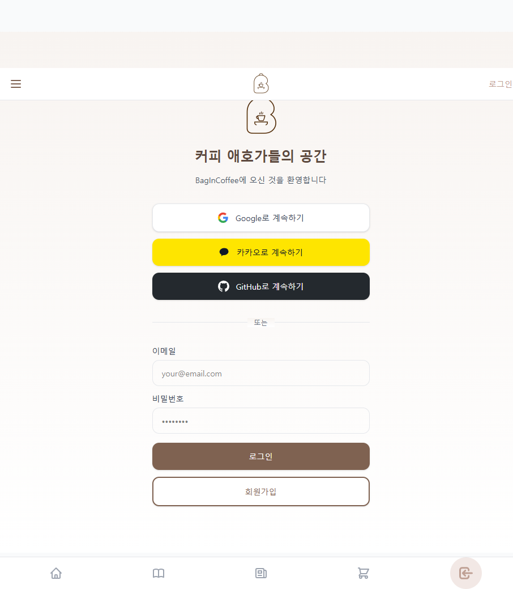
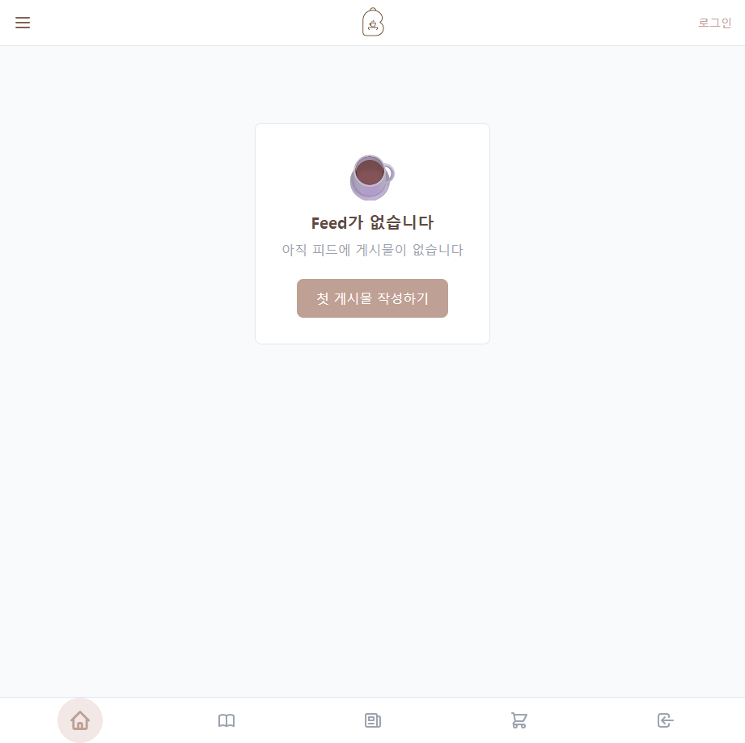
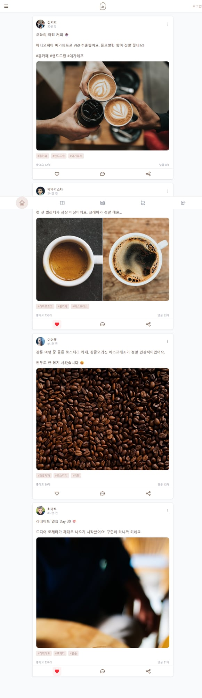
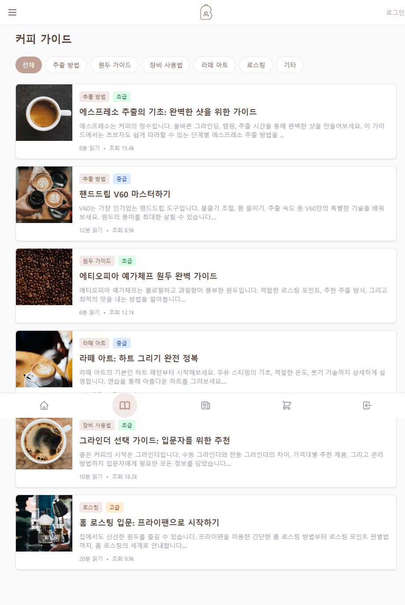
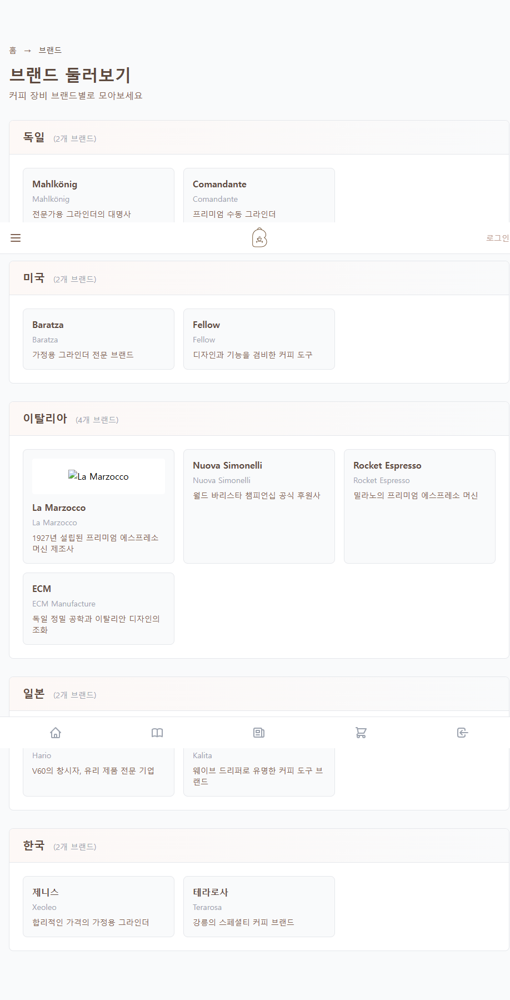
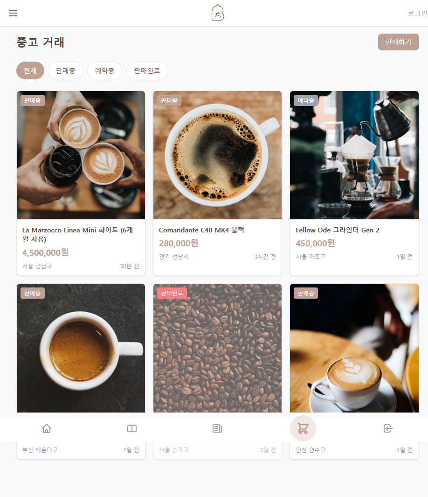
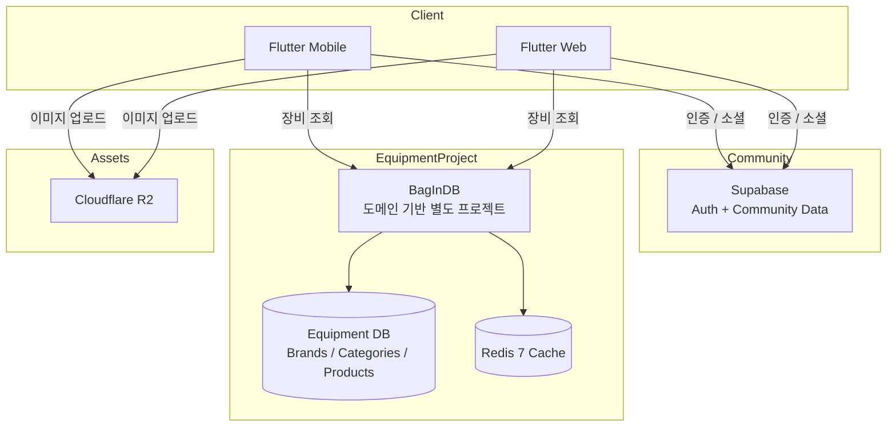

# BagInCoffee

> 문제 해결을 위해 Svelte에서 Flutter(Web + Mobile)로 전환하고, 장비 도메인을 BagInDB로 분리한 커피 커뮤니티 플랫폼

[](https://flutter.dev)
[](https://kit.svelte.dev)
[](https://www.rust-lang.org)
[](https://www.postgresql.org)
[](https://redis.io)
[](https://supabase.com)
[](./LICENSE)

BagInCoffee는 커피 애호가들이 장비를 탐색하고, 피드를 작성하고, 가이드를 읽고, 브루잉 기록을 남길 수 있도록 만든 서비스입니다.  
초기에는 **SvelteKit으로 웹을 개발하고, 그 흐름을 앱 개발까지 확장**하려고 했습니다. 하지만 실제로 진행해보니 **웹앱 방식은 불안정했고**, 앱을 목표로 한 개발 경험 자체도 Svelte 환경에서는 아쉬움이 컸습니다. 그래서 클라이언트는 **Flutter로 재구성해 웹과 모바일을 모두 전환**했습니다. 이 과정에서 **자체 그래픽 엔진을 가진 프레임워크를 직접 테스트해보고 싶다**는 기술적 동기도 함께 반영했습니다. 동시에 장비 영역은 **도메인 기반의 별도 프로젝트 `BagInDB`**로 분리하고 **Redis 캐시**를 도입해 조회 부담을 줄였습니다. 최종적으로는 **Flutter(Web + Mobile) + Supabase + BagInDB** 구조로 시스템을 엮었습니다.

## 프로젝트 요약

| 항목 | 내용 |
|------|------|
| 유형 | Full-Stack Product |
| 역할 | 1인 개발 |
| 구성 | Flutter 웹/모바일 + Supabase + BagInDB |
| 규모 | 51,100+ LOC |
| 인증 | Supabase Auth + JWT |
| 데이터 | Supabase(Auth/커뮤니티) + BagInDB(장비 데이터) + Redis + Cloudflare R2 |

## 내가 한 일

- 서비스 기획, 화면 구조 설계, 데이터 모델링
- SvelteKit 초기 프로토타입 구현
- Flutter 웹/모바일 통합 클라이언트 구현
- Rust/Axum 백엔드 및 API 설계
- 장비 영역을 별도 프로젝트인 BagInDB로 분리하는 구조 설계
- PostgreSQL JSONB 기반 제품/브랜드/카테고리 구조 설계
- Redis 캐싱 전략과 캐시 무효화 로직 구성

## 왜 이 프로젝트가 포트폴리오로 의미가 있는가

### 1. Svelte 기반 접근의 한계를 해결하기 위해 Flutter(Web + Mobile)로 전환했다

- 초기에 SvelteKit으로 서비스 구조와 사용자 흐름을 빠르게 검증했습니다.
- 이후 웹 개발 흐름을 앱 개발까지 확장하려 했지만, 웹앱 방식은 안정성과 개발 경험 측면에서 한계가 있었습니다.
- 그래서 핵심 클라이언트를 **Flutter 기반으로 재구성해 웹과 모바일을 함께 운영하는 방향**으로 전환했습니다.
- 이 과정에서 **자체 그래픽 엔진 기반 프레임워크를 실제 프로젝트에 적용해보는 실험**도 함께 진행했습니다.

### 2. 장비 데이터 조회 비용을 줄이기 위해 BagInDB와 Redis 캐시를 도입했다

- 사용자, 인증, 커뮤니티 성격의 데이터는 Supabase 축에서 처리했습니다.
- 브랜드, 카테고리, 제품 스펙처럼 성격이 다른 장비 영역은 **도메인 기반 별도 프로젝트 `BagInDB`**로 분리했습니다.
- 반복 조회가 많은 장비 데이터는 **Redis 캐시**를 도입해 응답 부담을 낮췄습니다.
- 결과적으로 **Flutter 웹/모바일 클라이언트**가 **Supabase + BagInDB** 두 축을 함께 사용하는 구조가 되었습니다.

### 3. Flutter 웹/모바일과 BagInDB를 하나의 인증 흐름으로 통합했다

- Flutter 웹, Flutter 모바일, BagInDB가 각각 따로 인증을 처리하면 구조가 쉽게 복잡해집니다.
- 이 문제를 줄이기 위해 Supabase Auth를 공통 축으로 두고, BagInDB에서는 JWT 검증을 일관되게 처리했습니다.
- 결과적으로 클라이언트는 토큰 전달에 집중하고, 권한 검증은 서버 쪽에서 통제하는 구조를 만들었습니다.

### 4. 장비 데이터 구조를 JSONB 중심으로 설계했다

- 커피 장비는 카테고리마다 필요한 스펙이 전부 다릅니다.
- 고정 컬럼 방식보다 확장성이 중요하다고 판단해 PostgreSQL JSONB 기반으로 설계했습니다.
- 그 위에 동적 필터링과 Redis 캐싱을 얹어, 확장성과 조회 성능을 같이 챙겼습니다.

## 개발 흐름

### Phase 1. SvelteKit으로 빠르게 제품 형태 검증

- 피드, 브랜드/장비 탐색, 가이드, 매거진, 관리자 기능을 먼저 구현
- 정보 구조와 화면 흐름을 빠르게 확인

### Phase 2. Flutter로 웹과 모바일 클라이언트를 재구성

- 웹앱 방식의 불안정성과 앱 개발 경험의 한계를 확인
- 앱 수준 사용자 경험과 크로스플랫폼 일관성은 Flutter가 더 적합하다고 판단
- 브루잉 기록, 피드 소비, 프로필 경험을 Flutter 기반으로 웹/모바일 모두 재설계

### Phase 3. 장비 영역을 BagInDB로 분리하고 Redis 캐시 도입

- 장비/브랜드/카테고리 API를 도메인 기반 별도 Rust 서비스인 BagInDB로 구성
- Supabase와 분리된 장비 데이터 축을 만들고, 앱/웹에서 함께 사용할 수 있도록 연결
- JSONB 필터링, Redis 캐싱, JWT 검증 구조를 통합

## 핵심 기술 포인트

- **SvelteKit -> Flutter 전환 판단**
  Svelte 기반 접근은 빠른 검증에는 유리했지만, 웹앱 방식의 안정성과 앱 개발 경험 측면에서는 한계가 있었습니다. 그래서 핵심 클라이언트를 Flutter로 전환해 웹과 모바일을 함께 가져갔습니다.

- **자체 그래픽 엔진 프레임워크 검증**
  Flutter를 선택한 이유 중 하나는 자체 그래픽 엔진을 가진 프레임워크를 실제 서비스에 적용해보고, UI 일관성과 렌더링 경험을 직접 검증해보고 싶었기 때문입니다.

- **도메인 기반 별도 프로젝트 분리**
  인증/커뮤니티 영역은 Supabase 축으로 두고, 장비 데이터 영역은 BagInDB라는 별도 프로젝트로 분리했습니다.

- **Redis 캐싱**
  반복 조회가 많은 장비 데이터는 Redis 캐시를 도입해 응답 비용과 조회 부담을 줄였습니다.

- **통합 인증 구조**
  Supabase Auth를 기준으로 Flutter 웹, Flutter 모바일, BagInDB가 하나의 인증 체계를 공유합니다.

- **JSONB 기반 동적 제품 스펙**
  카테고리마다 다른 장비 스펙을 유연하게 담으면서도 필터링 가능한 구조로 설계했습니다.

## 주요 지표

| 항목 | 수치 |
|------|------:|
| 총 코드량 | 51,100+ |
| 백엔드 API 엔드포인트 | 28+ |
| 브랜드 수 | 67 |
| 카테고리 수 | 34 |
| 제품 수 | 62 |
| 지원 언어 | 3 |
| 캐시 히트율 | 85%+ |

## 스크린샷

### 모바일 앱

<p align="center">
  
  
</p>

### 웹

<p align="center">
  
  
</p>

<p align="center">
  
  
</p>

## 아키텍처



## 서브 프로젝트

| 프로젝트 | 역할 | 기술 |
|------|------|------|
| `BagInCoffee-App` | 웹/모바일 통합 메인 클라이언트 | Flutter, Riverpod, Dio |
| `BagInCoffee-Web` | 초기 SvelteKit 프로토타입 | SvelteKit, TypeScript, Tailwind CSS |
| `BagInDB` | 장비 도메인을 분리한 별도 프로젝트 | Rust, Axum, SQLx, Redis |

## 저장소 구조

```text
BagInCoffee/
├── BagInCoffee-App/
├── BagInCoffee-Web/
├── BagInDB/
├── screenshots/
├── CONTRIBUTING.md
├── LICENSE
└── README.md
```

## 참고 문서

- [모바일 앱 README](./BagInCoffee-App/README.md)
- [초기 SvelteKit 프로토타입 README](./BagInCoffee-Web/README.md)
- [백엔드 README](./BagInDB/README.md)
- [Supabase 인증 이슈 정리](./BagInCoffee-Web/SUPABASE_AUTH_FIX.md)
- [Svelte 5 마이그레이션 리뷰](./BagInCoffee-Web/SVELTE5_REVIEW.md)

## 라이선스

이 프로젝트는 MIT 라이선스를 따릅니다. 자세한 내용은 [LICENSE](./LICENSE)를 참고해주세요.
