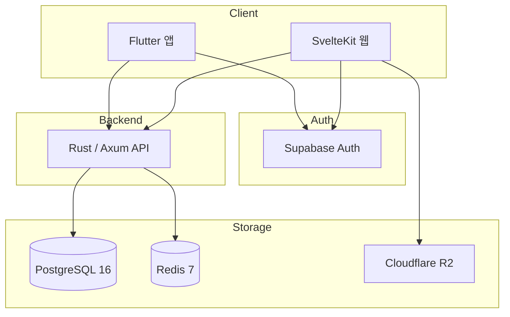

# BagInCoffee

> 커피 애호가를 위한 커뮤니티 플랫폼

[](https://flutter.dev)
[](https://kit.svelte.dev)
[](https://www.rust-lang.org)
[](https://www.postgresql.org)
[](https://redis.io)
[](https://supabase.com)
[](./LICENSE)

BagInCoffee는 커피를 좋아하는 사용자들이 장비를 탐색하고, 피드를 작성하고, 가이드를 읽고, 브루잉 기록을 남길 수 있도록 만든 서비스입니다.  
초기에는 **SvelteKit 기반 웹 프로젝트**로 시작해 제품 구조와 기능을 먼저 구체화했고, 이후 실제 사용 흐름을 더 잘 담기 위해 **Flutter 기반 모바일 앱 중심으로 확장**했습니다. 현재는 **Flutter 앱 + SvelteKit 웹 + Rust/Axum 백엔드**를 함께 운영하는 구조입니다.

## 프로젝트 개요

- 1인 개발 프로젝트
- `BagInCoffee-App`, `BagInCoffee-Web`, `BagInDB` 3개 서브 프로젝트로 구성
- 총 51,100+ LOC 규모
- Supabase Auth 기반 인증과 JWT 검증 구조 통합
- PostgreSQL JSONB 기반 다국어/동적 스펙 데이터 설계
- Redis 캐싱을 통한 응답 성능 최적화

## 개발 흐름

### 1. 웹으로 시작

- SvelteKit으로 서비스 구조와 화면 흐름을 먼저 설계
- 피드, 브랜드/장비 탐색, 가이드, 매거진, 관리자 기능을 웹에서 우선 구현
- 어떤 정보 구조와 탐색 방식이 맞는지 빠르게 검증

### 2. Flutter로 확장

- 실제 사용자 경험은 모바일이 더 적합하다고 판단해 Flutter 앱 개발로 전환
- 브루잉 기록, 피드 소비, 프로필 관리 같은 핵심 사용 흐름을 앱 중심으로 재정리
- 웹은 정보 탐색과 관리 기능, 앱은 메인 사용자 경험을 담당하는 방향으로 구성

### 3. 백엔드 통합

- Rust/Axum 백엔드로 장비/브랜드/카테고리 API를 별도 구성
- Supabase Auth와 연동해 앱, 웹, 백엔드가 하나의 인증 체계를 공유
- Redis 캐시와 PostgreSQL JSONB 필터링으로 조회 성능과 확장성을 확보

## 스크린샷

### 모바일 앱

<p align="center">
  
  
</p>

### 웹

<p align="center">
  
  
</p>

<p align="center">
  
  
</p>

## 아키텍처



## 핵심 기능

- 커피 장비/브랜드/카테고리 탐색
- JSONB 기반 동적 스펙 필터링
- 소셜 피드, 댓글, 프로필 관리
- 가이드/매거진/마켓플레이스 기능
- 역할 기반 관리자 기능
- Redis 캐시 기반 조회 최적화

## 기술 스택

| 계층 | 기술 |
|------|------|
| 모바일 | Flutter, Riverpod, Dio, GoRouter |
| 웹 | SvelteKit 2, Svelte 5, TypeScript, Tailwind CSS 4 |
| 백엔드 | Rust, Axum, SQLx |
| 데이터 | PostgreSQL 16, Redis 7 |
| 인증 | Supabase Auth, JWT |
| 스토리지 | Cloudflare R2 |

## 프로젝트 구조

```text
BagInCoffee/
├── BagInCoffee-App/    # Flutter 모바일 앱
├── BagInCoffee-Web/    # SvelteKit 웹 앱
├── BagInDB/            # Rust/Axum 백엔드
├── screenshots/        # README 이미지 자산
├── CONTRIBUTING.md
├── LICENSE
└── README.md
```

## 주요 지표

| 항목 | 수치 |
|------|------:|
| 총 코드량 | 51,100+ |
| 백엔드 API 엔드포인트 | 28+ |
| 브랜드 수 | 67 |
| 카테고리 수 | 34 |
| 제품 수 | 62 |
| 지원 언어 | 3 |
| 캐시 히트율 | 85%+ |

## 실행 방법

### 1. 백엔드 실행

```bash
cd BagInDB
cargo build
sqlx migrate run
cargo run
```

### 2. Flutter 앱 실행

```bash
cd BagInCoffee-App
flutter pub get
flutter run
```

### 3. 웹 실행

```bash
cd BagInCoffee-Web
npm install
npm run dev
```

## 환경 변수

각 서브 프로젝트는 자체 `.env.example` 파일을 포함합니다.

- `BagInCoffee-App/.env.example`
- `BagInCoffee-Web/.env.example`
- `BagInDB/.env.example`

## 하위 문서

- [모바일 앱 README](./BagInCoffee-App/README.md)
- [웹 README](./BagInCoffee-Web/README.md)
- [백엔드 README](./BagInDB/README.md)
- [Supabase 인증 이슈 정리](./BagInCoffee-Web/SUPABASE_AUTH_FIX.md)
- [Svelte 5 마이그레이션 리뷰](./BagInCoffee-Web/SVELTE5_REVIEW.md)

## 기여

기여 방법은 [CONTRIBUTING.md](./CONTRIBUTING.md)를 참고해주세요.

## 라이선스

이 프로젝트는 MIT 라이선스를 따릅니다. 자세한 내용은 [LICENSE](./LICENSE)를 참고해주세요.
