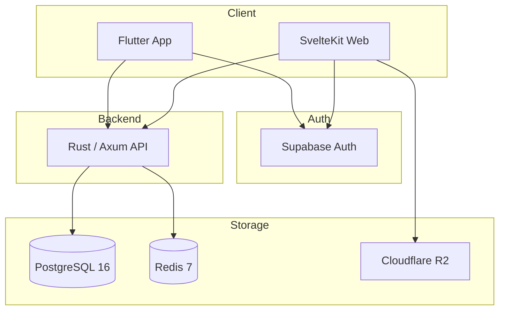

# BagInCoffee

> Coffee community platform with mobile, web, and Rust backend services.

[](https://flutter.dev)
[](https://kit.svelte.dev)
[](https://www.rust-lang.org)
[](https://www.postgresql.org)
[](https://redis.io)
[](https://supabase.com)
[](./LICENSE)

BagInCoffee is an all-in-one platform for coffee enthusiasts. It combines a Flutter mobile app, a SvelteKit web app, and a Rust/Axum backend around one shared auth and data model.

## Overview

- 1-person build across product planning, frontend, backend, and DB design
- 3 subprojects: `BagInCoffee-App`, `BagInCoffee-Web`, `BagInDB`
- 51,100+ LOC across Dart, TypeScript, and Rust
- Supabase Auth + JWT validation across all clients
- PostgreSQL JSONB product catalog with Redis caching
- Coffee feed, magazine, guide, marketplace, and brewing log features

## Screenshots

### Mobile App

<p align="center">
  
  
</p>

### Web App

<p align="center">
  
  
</p>

<p align="center">
  
  
</p>

## Architecture



## Key Features

- Product catalog with multilingual JSONB fields and category-specific specs
- Dynamic filtering for brands, categories, prices, and spec attributes
- Social feed, comments, profile management, and content publishing
- Marketplace and magazine flows in both app and web experiences
- Role-based admin workflows with JWT-backed authorization
- Redis-backed cache layer with selective invalidation

## Tech Stack

| Layer | Stack |
|------|------|
| Mobile | Flutter, Riverpod, Dio, GoRouter |
| Web | SvelteKit 2, Svelte 5, TypeScript, Tailwind CSS 4 |
| Backend | Rust, Axum, SQLx |
| Data | PostgreSQL 16, Redis 7 |
| Auth | Supabase Auth, JWT |
| Storage | Cloudflare R2 |

## Repository Structure

```text
BagInCoffee/
├── BagInCoffee-App/    # Flutter mobile app
├── BagInCoffee-Web/    # SvelteKit web app
├── BagInDB/            # Rust/Axum backend
├── screenshots/        # README assets
├── CONTRIBUTING.md
├── LICENSE
└── README.md
```

## Notable Metrics

| Metric | Value |
|------|------:|
| Total LOC | 51,100+ |
| Backend API endpoints | 28+ |
| Brands | 67 |
| Categories | 34 |
| Products | 62 |
| Supported languages | 3 |
| Cache hit rate | 85%+ |

## Getting Started

### 1. Backend

```bash
cd BagInDB
cargo build
sqlx migrate run
cargo run
```

### 2. Mobile App

```bash
cd BagInCoffee-App
flutter pub get
flutter run
```

### 3. Web App

```bash
cd BagInCoffee-Web
npm install
npm run dev
```

## Environment Variables

Each subproject ships its own `.env.example`.

- `BagInCoffee-App/.env.example`
- `BagInCoffee-Web/.env.example`
- `BagInDB/.env.example`

## Subproject Docs

- [Mobile App README](./BagInCoffee-App/README.md)
- [Web App README](./BagInCoffee-Web/README.md)
- [Backend README](./BagInDB/README.md)
- [Web auth fix note](./BagInCoffee-Web/SUPABASE_AUTH_FIX.md)
- [Svelte 5 migration review](./BagInCoffee-Web/SVELTE5_REVIEW.md)

## Contributing

See [CONTRIBUTING.md](./CONTRIBUTING.md).

## License

This project is licensed under the MIT License. See [LICENSE](./LICENSE).
