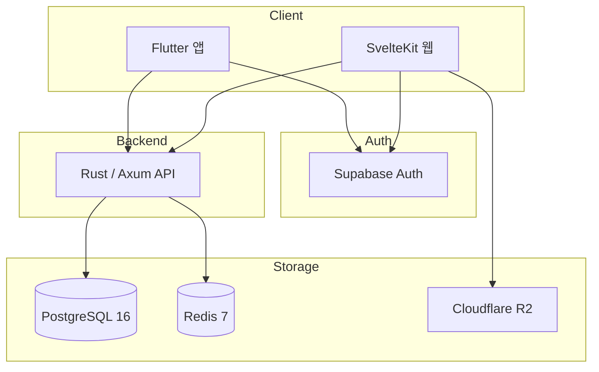

# BagInCoffee

> Svelte 기반 접근의 한계를 겪고 Flutter로 전환한 커피 커뮤니티 플랫폼

[](https://flutter.dev)
[](https://kit.svelte.dev)
[](https://www.rust-lang.org)
[](https://www.postgresql.org)
[](https://redis.io)
[](https://supabase.com)
[](./LICENSE)

BagInCoffee는 커피 애호가들이 장비를 탐색하고, 피드를 작성하고, 가이드를 읽고, 브루잉 기록을 남길 수 있도록 만든 서비스입니다.  
초기에는 **SvelteKit 기반으로 웹과 앱 경험을 함께 가져가려는 방향**으로 시작했지만, 실제 개발을 진행하면서 **앱 개발 관점의 한계**가 분명했습니다. 그래서 핵심 사용자 경험은 **Flutter로 전환**했고, 최종적으로는 **Flutter 앱 + SvelteKit 웹 + Rust/Axum 백엔드**를 하나의 인증/데이터 구조로 통합했습니다.

## 프로젝트 요약

| 항목 | 내용 |
|------|------|
| 유형 | Full-Stack Product |
| 역할 | 1인 개발 |
| 구성 | Flutter 앱 + SvelteKit 웹 + Rust/Axum 백엔드 |
| 규모 | 51,100+ LOC |
| 인증 | Supabase Auth + JWT |
| 데이터 | PostgreSQL 16 + Redis 7 + Cloudflare R2 |

## 내가 한 일

- 서비스 기획, 화면 구조 설계, 데이터 모델링
- SvelteKit 웹 프론트엔드 구현
- Flutter 모바일 앱 구현
- Rust/Axum 백엔드 및 API 설계
- PostgreSQL JSONB 기반 제품/브랜드/카테고리 구조 설계
- Redis 캐싱 전략과 캐시 무효화 로직 구성

## 왜 이 프로젝트가 포트폴리오로 의미가 있는가

### 1. Svelte 기반 앱 개발의 한계를 경험하고 Flutter로 전환했다

- 초기에 SvelteKit으로 서비스 구조와 사용자 흐름을 빠르게 검증했습니다.
- 하지만 앱 수준의 사용자 경험을 만들기에는 구조적 한계가 있다고 판단했습니다.
- 그래서 웹을 버린 것이 아니라, **웹은 탐색/관리**, **앱은 Flutter 기반 핵심 경험**으로 역할을 다시 나눴습니다.

### 2. 3개 클라이언트/서버 축을 하나의 인증 구조로 통합했다

- Flutter, SvelteKit, Rust 백엔드가 각각 따로 인증을 처리하면 구조가 쉽게 복잡해집니다.
- 이 문제를 줄이기 위해 Supabase Auth를 공통 축으로 두고, 백엔드에서 JWT 검증을 일관되게 처리했습니다.
- 결과적으로 클라이언트는 토큰 전달에 집중하고, 권한 검증은 서버 쪽에서 통제하는 구조를 만들었습니다.

### 3. 제품 데이터 구조를 JSONB 중심으로 설계했다

- 커피 장비는 카테고리마다 필요한 스펙이 전부 다릅니다.
- 고정 컬럼 방식보다 확장성이 중요하다고 판단해 PostgreSQL JSONB 기반으로 설계했습니다.
- 그 위에 동적 필터링과 Redis 캐싱을 얹어, 확장성과 조회 성능을 같이 챙겼습니다.

## 개발 흐름

### Phase 1. SvelteKit으로 빠르게 제품 형태 검증

- 피드, 브랜드/장비 탐색, 가이드, 매거진, 관리자 기능을 먼저 구현
- 정보 구조와 화면 흐름을 빠르게 확인

### Phase 2. 앱 개발 한계 확인 후 Flutter로 전환

- 앱 수준 사용자 경험은 Svelte 기반 접근보다 Flutter가 더 적합하다고 판단
- 브루잉 기록, 피드 소비, 프로필 경험을 Flutter 앱 중심으로 재설계

### Phase 3. Rust 백엔드로 데이터/권한 통합

- 장비/브랜드/카테고리 API를 별도 Rust 서비스로 분리
- JSONB 필터링, Redis 캐싱, JWT 검증 구조를 통합

## 핵심 기술 포인트

- **SvelteKit -> Flutter 전환 판단**
  Svelte 기반 접근은 빠른 검증에는 유리했지만, 앱 개발 관점에서는 한계가 있었습니다. 그래서 핵심 사용자 경험은 Flutter로 전환했습니다.

- **통합 인증 구조**
  Supabase Auth를 기준으로 앱, 웹, 백엔드가 하나의 인증 체계를 공유합니다.

- **JSONB 기반 동적 제품 스펙**
  카테고리마다 다른 장비 스펙을 유연하게 담으면서도 필터링 가능한 구조로 설계했습니다.

- **Redis 캐싱**
  자주 조회되는 데이터는 캐싱하고, 변경 시 패턴 단위로 무효화하는 방식으로 응답 성능을 유지했습니다.

## 주요 지표

| 항목 | 수치 |
|------|------:|
| 총 코드량 | 51,100+ |
| 백엔드 API 엔드포인트 | 28+ |
| 브랜드 수 | 67 |
| 카테고리 수 | 34 |
| 제품 수 | 62 |
| 지원 언어 | 3 |
| 캐시 히트율 | 85%+ |

## 스크린샷

### 모바일 앱

<p align="center">
  
  
</p>

### 웹

<p align="center">
  
  
</p>

<p align="center">
  
  
</p>

## 아키텍처



## 서브 프로젝트

| 프로젝트 | 역할 | 기술 |
|------|------|------|
| `BagInCoffee-App` | 모바일 메인 사용자 경험 | Flutter, Riverpod, Dio |
| `BagInCoffee-Web` | 웹 탐색/관리 경험 | SvelteKit, TypeScript, Tailwind CSS |
| `BagInDB` | 장비/브랜드/카테고리 API | Rust, Axum, SQLx, Redis |

## 저장소 구조

```text
BagInCoffee/
├── BagInCoffee-App/
├── BagInCoffee-Web/
├── BagInDB/
├── screenshots/
├── CONTRIBUTING.md
├── LICENSE
└── README.md
```

## 참고 문서

- [모바일 앱 README](./BagInCoffee-App/README.md)
- [웹 README](./BagInCoffee-Web/README.md)
- [백엔드 README](./BagInDB/README.md)
- [Supabase 인증 이슈 정리](./BagInCoffee-Web/SUPABASE_AUTH_FIX.md)
- [Svelte 5 마이그레이션 리뷰](./BagInCoffee-Web/SVELTE5_REVIEW.md)

## 라이선스

이 프로젝트는 MIT 라이선스를 따릅니다. 자세한 내용은 [LICENSE](./LICENSE)를 참고해주세요.
